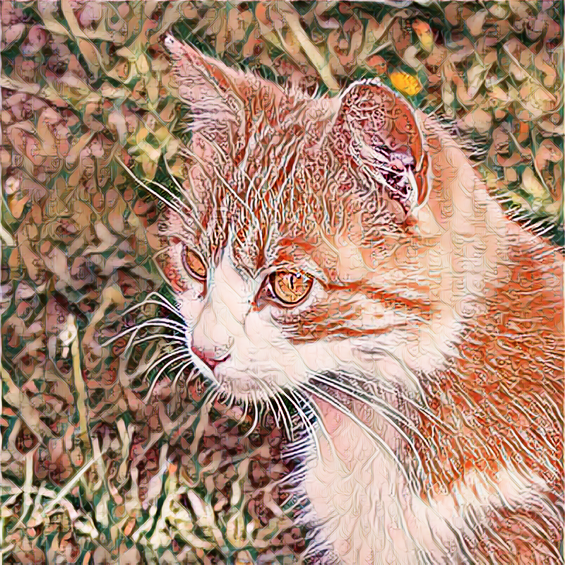

# Ex8: Fast Neural Style Transfer

## 概要

この課題では、Fast Neural Style Transfer のソースコードを使用して、画像のスタイル変換を行いました。
Neural Style Transfer は、コンテンツ画像の構造を保ちながら、スタイル画像の色・模様・質感を転写する手法です。

本実験では、自分用に用意した **reverie 画像** をスタイル画像として使用し、COCO データセットを用いてモデルを学習しました。
学習後、猫の画像に対してスタイル変換を行い、結果画像を生成しました。

## 使用したソースコード

以下のソースコードを参考・使用しました。

- Fast Neural Style Transfer / PyTorch 実装  
  https://github.com/pytorch/examples/tree/main/fast_neural_style

このコードをもとに、スタイル画像、学習条件、パラメータなどを自分の実験用に変更して実行しました。

## 使用データ

### スタイル画像

- 使用画像: `./style_img/our_style_img.png`
- 内容: 自分用に用意した reverie 画像
- 目的: 学習モデルに転写したい画風として使用

### 学習データセット

- 使用データセット: COCO データセット
- データセットパス:

```bash
/export/data/dataset/COCO
```

COCO データセットの画像をコンテンツ画像として使用し、reverie 画像のスタイルを学習するモデルを作成しました。

## 変更したパラメータ

実験では、以下のパラメータを変更しました。

| パラメータ | 変更後の値 | 説明 |
|---|---:|---|
| `lambda_style` | `500` | スタイル損失の重み |
| `learning_rate` | `1e-4` | 学習率 |
| `batch_size` | `8` | 一度に学習する画像枚数 |
| `num_data_loader_workers` | `2` | データ読み込み用 worker 数 |

`lambda_style` を 500 に設定することで、スタイル画像の特徴が結果画像に反映されるようにしました。
また、学習率を `1e-4`、バッチサイズを `8` に設定し、GPU 環境で安定して学習できるようにしました。

## 学習コマンド

学習は以下のコマンドで実行しました。

```bash
CUDA_VISIBLE_DEVICES=0,1,2,3 python train.py \
  --dataset_path /export/data/dataset/COCO \
  --style_image_path ./style_img/our_style_img.png > log.txt 2>&1 &
```

### コマンドの説明

- `CUDA_VISIBLE_DEVICES=0,1,2,3`  
  GPU 0, 1, 2, 3 を使用して学習を実行します。

- `python train.py`  
  学習用スクリプトを実行します。

- `--dataset_path /export/data/dataset/COCO`  
  学習に使用する COCO データセットのパスを指定します。

- `--style_image_path ./style_img/our_style_img.png`  
  スタイル画像として reverie 画像を指定します。

- `> log.txt 2>&1 &`  
  学習ログを `log.txt` に保存し、バックグラウンドで実行します。

## スタイル変換コマンド

学習したモデルを使って、猫の画像にスタイル変換を行いました。

```bash
python stylize.py ./models/our_style_model.pt ./cat.png ./output_img/result_our.png
```

### コマンドの説明

- `./models/our_style_model.pt`  
  学習によって作成されたスタイル変換モデルです。

- `./cat.png`  
  スタイル変換を行う入力画像です。

- `./output_img/result_our.png`  
  生成されたスタイル変換結果画像です。

## 学習結果

最後の epoch における損失は以下の通りです。

| 項目 | 値 |
|---|---:|
| Train loss | `15.33` |
| Validation loss | `14.58` |

Train loss と Validation loss が大きく離れていないため、学習データだけに過度に適応している状態ではなく、比較的安定して学習できたと考えられます。

## 結果画像

以下は、学習したモデルを用いて猫画像をスタイル変換した結果です。



## 考察

今回の実験では、reverie 画像をスタイル画像として使用し、COCO データセットで Fast Neural Style Transfer モデルを学習しました。
スタイル損失の重みである `lambda_style` を 500 に設定したことで、スタイル画像の色や質感が出力画像に反映されるようになりました。

一方で、スタイルを強くしすぎると元画像の内容が分かりにくくなる可能性があります。
そのため、スタイルの強さとコンテンツの保持のバランスを調整することが重要だと分かりました。

最終的に、Train loss は `15.33`、Validation loss は `14.58` となり、学習は安定して進んだと考えられます。
また、学習済みモデルを使用することで、入力画像に対して高速にスタイル変換を行うことができました。

## ファイル構成

```text
ex8/
├── train.py
├── stylize.py
├── style_img/
│   └── our_style_img.png
├── models/
│   └── our_style_model.pt
├── output_img/
│   └── result_our.png
├── cat.png
├── log.txt
└── README.md
```

## まとめ

Fast Neural Style Transfer を用いることで、1 枚のスタイル画像から画風を学習し、任意の画像に対して高速にスタイル変換を行うことができました。
本実験では、自分で用意した reverie 画像をスタイルとして使用し、COCO データセットで学習を行いました。
その結果、猫画像に対して reverie 画像の特徴を反映したスタイル変換結果を得ることができました。
